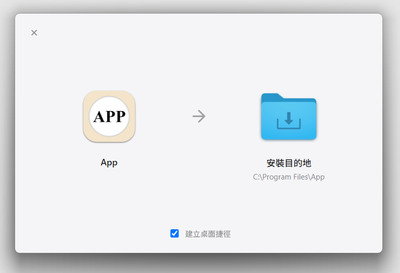
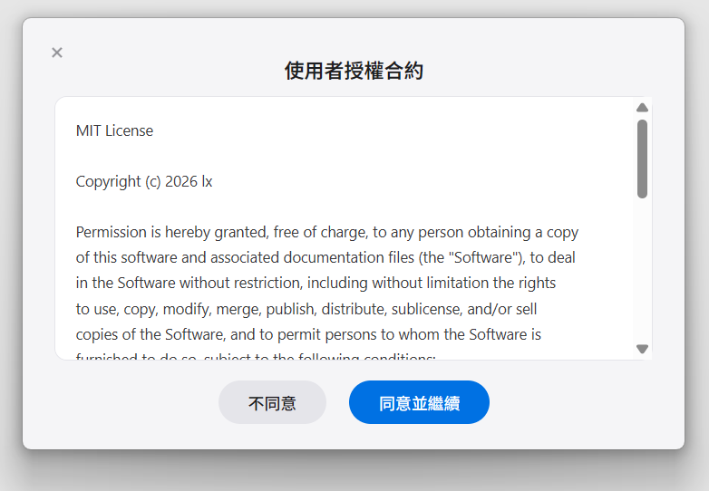
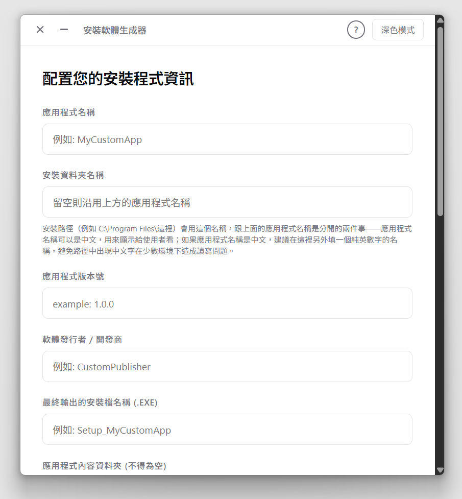
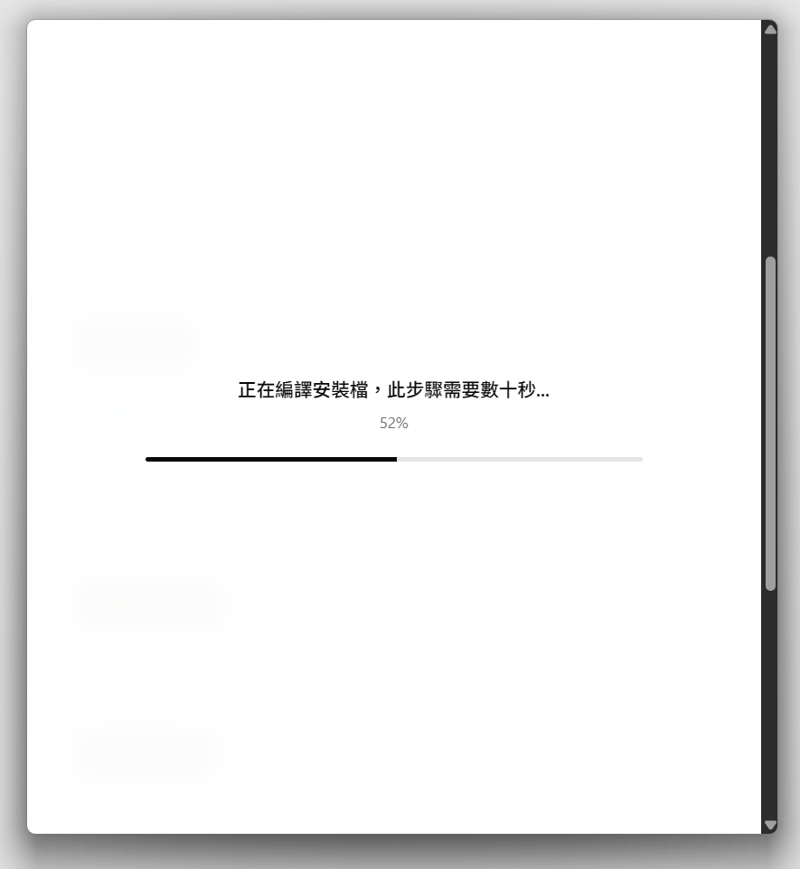

# mac-style-windows-installer

**A tool that packages any Windows application into a macOS-DMG-style drag-to-install experience.**
**把任何 Windows 應用程式打包成 macOS DMG 風格、拖曳即可安裝的體驗。**


**Language: [English](#english) | [繁體中文](#繁體中文)**

---

## English

### What is this?

One project, two parts:

1. **The Builder Tool** — a desktop app you run once, to configure and compile an installer for *your own* software.
2. **The installer it produces** — the `.exe` your end users actually download and run. Instead of a Windows-style "Next → Next → Next" wizard, they get a macOS-style window: drag your app's icon onto a folder to install it.

Both halves — the Builder Tool and every installer it produces — are standalone Windows desktop apps. The interface runs on [pywebview](https://pywebview.flowrl.com/), and everything is packaged into a single `.exe` with [PyInstaller](https://pyinstaller.org/).

> **⚠️ Built with substantial help from Claude (Anthropic's AI).** The architecture, the code, and this README were all written in collaboration with an AI. If that matters to how you evaluate a project, now you know. Bug reports and code review are genuinely welcome — AI-assisted doesn't mean bug-free; if anything, it means an extra pair of eyes helps more, not less.

### Screenshots

| Drag to Install | EULA Screen |
|---|---|
|  |  |

| Builder Tool — Main Screen | Build Progress |
|---|---|
|  |  |

*Top row: what your end users see. Bottom row: what you see while building the installer.*

### Features

**Building the installer (Builder Tool)**

Everything you configure lives in one form:
- App display name (any language) is kept separate from the install-folder name (stick to ASCII here) — one is what users see, the other is a filesystem path.
- Pick a main executable, PNG/ICO icons, optional EULA text, dependency hints (VC++ Redistributable / .NET Desktop Runtime — detected, not silently installed), file associations, and PATH registration.
- Checks its own environment on launch and tells you plainly if `pyinstaller`, `python`, or `pywebview` are missing, install command included.
- Works either way: run it straight as a `.py` script, or as a compiled `.exe` (see [Requirements](#requirements)).
- Real, staged build progress — not a progress bar that lies to you with a fake linear crawl.
- A resizable, frameless window with hand-built drag/resize handling (frameless windows lose the native resize grips by default, so this is implemented from scratch).
- A Help button with the full manual built in, so you're not hunting for a separate doc.

**The installer it produces**

What your users actually experience:
- A macOS DMG-style drag-to-install window, with custom drag handling (no native-drag jump glitch) and DPI-aware rendering.
- An EULA screen, shown only if you configured one.
- Real version comparison when an existing install is found — not just "is something there," but an actual old-vs-new check. Offers to upgrade only when the new version is genuinely newer, and clearly warns if you're about to install the same version or an older one.
- Disk space check, a check for whether the app is already running, and a single-instance lock so users can't accidentally kick off two installs at once.
- Real copy progress, plus **integrity verification after copying** (a CRC32 checksum, not just a file-size match).
- **Automatic rollback on failure** — if an install fails partway through, it cleans up after itself instead of leaving a half-installed mess.
- Desktop and Start Menu shortcuts, file associations, PATH registration.
- Full registry entries for "Apps & Features": `DisplayName`, `Publisher`, `DisplayVersion`, `InstallLocation`, `EstimatedSize`, `InstallDate`, `UninstallString`, `QuietUninstallString`.
- **A silent/CLI install mode** for enterprise deployment: `Setup_XXX.exe /S /D=C:\Apps\MyApp /NODESKTOPSHORTCUT`. The installer is built `--noconsole`, so it has nowhere to print to even from `cmd` — check the **exit code** instead (`echo %errorlevel%` right after running, or `$LASTEXITCODE` in PowerShell; `0` means success), and look at `%TEMP%\<app name>_silent_install_log.txt` for details.
- A manifest-based uninstaller that only removes what it installed, leaving anything the user created inside the install folder alone. It falls back to clearing the whole folder only if no manifest can be found.

### Requirements

To **run or build the Builder Tool** (`gui_config.py`, or a compiled `InstallerBuilder.exe`), the machine needs:

```
pip install pyinstaller pywebview pywin32 cryptography
```

- `pyinstaller` and `pywebview` are required — the Builder Tool checks for both on launch and tells you if either is missing.
- `pywin32` is optional; it only affects whether shortcuts get created.

The **installers it produces** are fully standalone — your end users don't need Python at all. The only external dependency is the **WebView2 Runtime**, a Windows system component that's pre-installed on Windows 11 and most up-to-date Windows 10 machines; it may be missing on older, un-updated Windows 10 installs.

### Usage

1. Install the requirements above.
2. Run `python gui_config.py` (or double-click `InstallerBuilder.exe`, if you've already built it — see below).
3. Fill in the form: app name, folder name, version, publisher, output filename, app folder, main executable, icons, and whichever optional settings you need.
4. Click "Start Building" (開始編譯安裝檔). The finished `.exe` lands in `dist/`.

To build `InstallerBuilder.exe` itself:

```
python build_config_tool.py
```

This opens a small build GUI where you can pick a custom `.ico` and watch the PyInstaller output as it runs.

Full documentation: see [`使用說明書.md`](docs/使用說明書.md) (Traditional Chinese).

### Roadmap

- [ ] Code signing for `InstallerBuilder.exe`, via [SignPath Foundation](https://signpath.org/)'s free open-source program (requires this repo plus a GitHub Actions build pipeline — installers *produced* by the tool would still be unsigned, since they're compiled locally rather than through this repo's CI)
- [ ] Multi-language UI — **not started, feasibility still under consideration.** Low priority unless there's real demand from non-Chinese-speaking users
- [ ] An optional stronger hash for integrity verification (currently CRC32; a cryptographic hash could be offered for higher-assurance use cases)
- [ ] A path to signing the *output* installers too (would mean moving the build step into CI — a bigger architectural change)

### Known Limitations

- Neither the Builder Tool nor the installers it produces are code-signed yet (see Roadmap).
- Dependency checks (VC++ Redistributable, .NET Desktop Runtime) are detection-only; the tool won't silently install the dependency itself.
- No multi-language UI yet — everything is in Traditional Chinese.
- Very old, un-updated Windows 10 machines may need the WebView2 Runtime installed separately.

### License

MIT — see [`LICENSE`](LICENSE).

---

## 繁體中文

### 這是什麼

一個專案，兩個部分：

1. **打包工具**——一個桌面應用程式，你執行它一次，設定並編譯出屬於**你自己軟體**的安裝檔。
2. **打包工具產出的安裝檔**——終端使用者實際下載、執行的那顆 `.exe`。不是傳統 Windows「下一步、下一步、下一步」的精靈式安裝，而是 macOS 風格的視窗：把你的軟體圖示拖到資料夾上就完成安裝。

打包工具本身，以及它產出的每一顆安裝檔，都是完全獨立的 Windows 桌面應用程式。介面用 [pywebview](https://pywebview.flowrl.com/) 呈現，整包再用 [PyInstaller](https://pyinstaller.org/) 打包成單一 `.exe`。

> **⚠️ 這個專案在 Claude（Anthropic 的 AI）大量協助下完成。** 架構、程式碼、連這份 README，都是跟 AI 協作寫出來的。如果這件事會影響你怎麼看待這個專案，現在你知道了。也歡迎回報 bug、歡迎 code review——AI 協助不代表沒有 bug；真要說有什麼差別，反而是更需要多一雙眼睛幫忙檢查。

### 截圖

| 拖曳安裝畫面 | EULA 同意頁 |
|---|---|
|  |  |

| 打包工具主畫面 | 編譯進度 |
|---|---|
|  |  |

*上排：你的終端使用者會看到的畫面。下排：你打包安裝檔時會看到的畫面。*

### 功能

**製作安裝檔（打包工具端）**

所有設定都在同一張表單裡完成：
- 應用程式顯示名稱（可以是任何語言）跟安裝資料夾名稱（建議用英數字）分開設定——一個是給使用者看的，一個是實際的檔案路徑。
- 選主要執行檔、PNG/ICO 圖示、選填的 EULA 文字、相依元件提示（VC++ Redistributable / .NET Desktop Runtime，只偵測不靜默安裝）、檔案關聯，以及是否加入 PATH。
- 開啟時會自動檢查執行環境，`pyinstaller`、`python`、`pywebview` 缺了哪一個都會直接告訴你，還附上安裝指令。
- 兩種跑法都支援：直接執行 `.py`，或編譯成 `.exe` 後雙擊使用（見下方〈環境需求〉）。
- 真實、分階段的編譯進度——不是一條會騙人的假線性進度條。
- 無邊框視窗也能自由調整大小（無邊框視窗預設會失去原生的縮放邊界，這是自己刻的拖曳縮放邏輯）。
- 內建「使用說明」按鈕，完整手冊就在工具裡，不用另外找文件。

**輸出的安裝檔**

使用者實際會體驗到的：
- macOS DMG 風格的拖曳安裝視窗，自訂拖曳邏輯（沒有原生拖曳常見的跳動問題），DPI 感知渲染。
- EULA 同意頁，只有你有設定才會出現。
- 偵測到已安裝版本時，會**真的比對新舊版本**，不是只看「有沒有裝過」——只有新版本才會主動問要不要更新，版本相同或更舊會清楚提示警告。
- 磁碟空間檢查、執行中偵測、單一實例鎖，避免使用者不小心同時開兩個安裝流程。
- 真實的複製進度，加上**複製後的完整性驗證**（CRC32 checksum，不只是比對檔案大小）。
- **失敗自動回滾**——安裝到一半失敗，會自動清乾淨，不留下裝一半的殘骸。
- 桌面／開始功能表捷徑、檔案關聯、加入 PATH。
- 「新增或移除程式」清單所需的完整登錄表欄位：`DisplayName`、`Publisher`、`DisplayVersion`、`InstallLocation`、`EstimatedSize`、`InstallDate`、`UninstallString`、`QuietUninstallString`。
- **靜默／命令列安裝模式**，給企業批次部署用：`Setup_XXX.exe /S /D=C:\Apps\MyApp /NODESKTOPSHORTCUT`。安裝檔是用 `--noconsole` 編譯的，就算從 `cmd` 執行也沒有主控台可以顯示文字——改看 process 的 **exit code** 就好（執行完緊接著在 cmd 打 `echo %errorlevel%`，或 PowerShell 打 `$LASTEXITCODE`，`0` 代表成功），詳細訊息會寫進 `%TEMP%\<應用程式名稱>_silent_install_log.txt`。
- 清單式解除安裝，只刪自己裝過的東西，使用者事後在安裝目錄裡自己產生的檔案不會被動到；真的找不到清單，才會退回清空整個資料夾。

### 環境需求

**執行或打包「打包工具」**（`gui_config.py`，或編譯好的 `InstallerBuilder.exe`）的這台電腦需要：

```
pip install pyinstaller pywebview pywin32 cryptography
```

- `pyinstaller` 跟 `pywebview` 是必要的——打包工具開啟時會檢查兩者，缺了會告訴你。
- `pywin32` 是選用的，只影響捷徑會不會被建立。

**打包工具產出的安裝檔**是完全獨立的，終端使用者完全不需要裝 Python。唯一的外部依賴是 **WebView2 Runtime**，這是 Windows 的系統元件，Windows 11 跟大多數更新過的 Windows 10 都已經內建；比較舊、沒更新過的 Windows 10 可能會缺這個元件。

### 使用方式

1. 安裝上面列的環境需求。
2. 執行 `python gui_config.py`（或雙擊已經編譯好的 `InstallerBuilder.exe`，見下方）。
3. 填寫表單：應用程式名稱、資料夾名稱、版本、發行者、輸出檔名、應用程式資料夾、主執行檔、圖示，以及你需要的其他選填設定。
4. 按下「開始編譯安裝檔」，編好的 `.exe` 會出現在 `dist/` 資料夾底下。

要打包 `InstallerBuilder.exe` 本身：

```
python build_config_tool.py
```

會開啟一個小型建置 GUI，可以選自訂的 `.ico`，並即時看到 PyInstaller 的輸出過程。

完整文件請見 [`使用說明書.md`](docs/使用說明書.md)。

### 未來方向

- [ ] 幫 `InstallerBuilder.exe` 透過 [SignPath Foundation](https://signpath.org/) 的免費開源方案做數位簽章（需要這個 repo 本身加上 GitHub Actions 建置流程；注意打包工具**產出**的安裝檔還是簽不到，因為那些是在使用者本機編譯出來的，不經過這個 repo 的 CI）
- [ ] 補齊 `ui/index.html` 漏翻譯的英文字串、把後端動態訊息（進度/錯誤文字）也納入多語言範圍（見〈已知限制〉）
- [ ] 完整性驗證的雜湊演算法升級選項（目前是 CRC32，未來可以考慮為更高安全需求的情境提供更強的密碼學雜湊）
- [ ] 讓**輸出的安裝檔**也能被簽章（代表要把編譯流程搬進 CI，是比較大的架構調整）

### 已知限制

- 打包工具本身、以及它產出的安裝檔，目前都還沒有數位簽章（見〈未來方向〉）。
- 相依元件檢查（VC++ Redistributable、.NET Desktop Runtime）只做偵測，不會靜默安裝該元件本身。
- 多語言介面已支援 `zh-TW`/`en`（依系統語言自動偵測，三個進入點——安裝、解除安裝、打包工具本身——都有），但範圍不完整：`ui/index.html`（安裝精靈主畫面）有 7 個字串還沒翻成英文（「程式正在執行」/「檔案使用中」/「偵測到較新版本」這三組畫面），英文系統上會 fallback 顯示中文；後端動態產生的進度/錯誤文字（例如「正在複製檔案...」）完全沒有納入這套機制，永遠是繁體中文。
- 非常舊、沒更新過的 Windows 10 機器，可能需要另外安裝 WebView2 Runtime。

### 授權

MIT——見 [`LICENSE`](LICENSE)。
